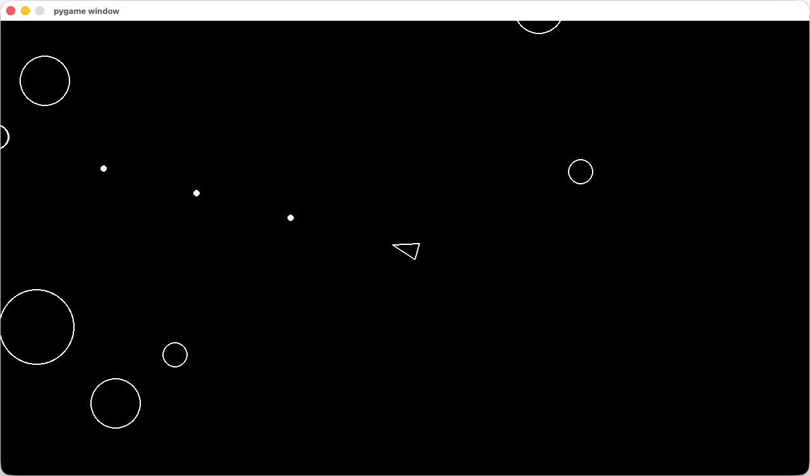
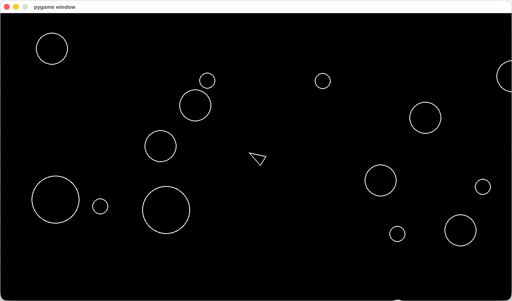

# Asteroids 🚀

A classic Asteroids arcade game clone built with Python and Pygame.


## About

This project is a recreation of the classic 1979 Atari Asteroids arcade game. Built as part of the [Boot.dev](https://boot.dev) "Build Asteroids using Python and Pygame" course, it demonstrates core game development concepts including object-oriented programming, collision detection, and game loop architecture.





## Features

- Player-controlled spaceship with rotation and thrust mechanics
- Asteroid spawning system with dynamic field generation
- Shooting mechanics to destroy asteroids
- Collision detection between all game objects
- Asteroids split into smaller pieces when destroyed

## Project Structure

```
asteroids/
├── main.py           # Game entry point and main loop
├── player.py         # Player spaceship class
├── asteroid.py       # Asteroid game object
├── asteroidfield.py  # Asteroid spawning and management
├── shot.py           # Projectile/bullet class
├── circleshape.py    # Base class for circular game objects
├── constants.py      # Game configuration values
├── logger.py         # Logging utilities
└── pyproject.toml    # Project dependencies
```

## Getting Started

### Prerequisites

- Python 3.12+
- [uv](https://github.com/astral-sh/uv) (recommended) or pip

### Installation

1. Clone the repository:
   ```bash
   git clone https://github.com/thebenwalther/asteroids.git
   cd asteroids
   ```

2. Install dependencies using uv:
   ```bash
   uv sync
   ```

   Or using pip:
   ```bash
   pip install pygame
   ```

### Running the Game

```bash
uv run python main.py
```

Or if using pip:
```bash
python main.py
```
On Mac you might need to use Python3
```bash
uv run python3 main.py
```
```bash
python3 main.py
```

## Controls

| Key | Action |
|-----|--------|
| `W` | Thrust forward |
| `S` | Thrust backward |
| `A` | Rotate left |
| `D` | Rotate right |
| `Space` | Shoot |

## Learning Outcomes

This project covers several fundamental programming and game development concepts:

- **Object-Oriented Programming**: Inheritance hierarchies with a base `CircleShape` class
- **Game Loop Architecture**: Update and render cycles with delta time
- **Vector Mathematics**: Movement, rotation, and velocity calculations
- **Collision Detection**: Circle-based collision algorithms
- **Pygame Fundamentals**: Surface drawing, event handling, and sprite management

## Acknowledgments

- [Boot.dev](https://boot.dev) for the excellent course and project guidance
- The original Asteroids game by Atari (1979) for the inspiration

## License

This project is licensed under the MIT License - see the [LICENSE](LICENSE) file for details.
